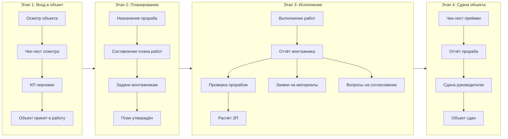
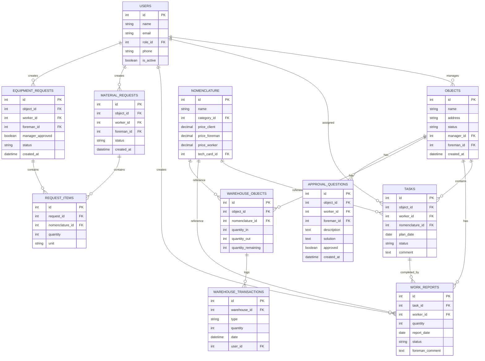

# CRM_GARANT
# CRM-система для управления электромонтажными работами

### Версия документа: 1.0.0

### Дата: 23/02/2026

---

## Содержание

[[#1. Общие сведения]]
[[#2. Цели и задачи]]
[[#3. Ролевая модель]]
[[#4. Бизнес-процессы]]
[[#5. Структура базы данных]]
[[#6. Технологический стек]]
[[#7. Варианты реализации]]
[[#8. Функциональные требования]]
[[#9. Дашборды и интерфейсы]]
[[#10. Безопасность]]
[[#11. Дорожная карта]]
[[#12. Оценка стоимости]]
[[#13. Критерии приёмки]]
[[#14. Приложения]]

---

## 1. Общие сведения

|Параметр|Значение|
|---|---|
|**Наименование проекта**|CRM для электромонтажных работ|
|**Назначение**|Автоматизация процессов электромонтажной компании от получения объекта до сдачи|
|**Цель MVP**|Оцифровка процесса, стандартизация, масштабирование|
|**Платформы**|Веб-версия (ПК) + Мобильное приложение (опционально)|
|**Офлайн-режим**|Обязателен для мобильных устройств|
|**Хостинг**|Облако (Yandex Cloud / AWS)|
|**Язык интерфейса**|Русский|
|**Роль заказчика в MVP**|Не реализуется (отложено на версию 2.0)|

---

## 2. Цели и задачи

### 2.1. Бизнес-цели

| №   | Цель                                    | KPI                                           |
| --- | --------------------------------------- | --------------------------------------------- |
| 1   | Стандартизация процессов работы         | Снижение ошибок                               |
| 2   | Прозрачность выполнения работ           | 100% задач в системе                          |
| 3   | Автоматизация расчёта ЗП                | Время расчёта сокращается                     |
| 4   | Контроль материалов                     | Снижение потерь материалов                    |
| 5   | Масштабирование на другие подразделения | Возможность быстрого запуска на новом объекте |

### 2.2. Задачи MVP

- Учёт объектов и их статусов
- Планирование задач монтажникам
- Ежедневные отчёты исполнителей
- Автоматический расчёт сдельной ЗП
- Заявки на материалы и снаряжение
- Складской учёт по объектам
- Вопросы на согласование
- Чек-листы (осмотр и приёмка)
- Уведомления

---

## 3. Ролевая модель

### 3.1. Описание ролей

|Роль|Описание|Доступ в системе|
|---|---|---|
|**Руководитель предприятия**|Директор / владелец бизнеса|Полный доступ ко всем объектам, финансам, пользователям|
|**Прораб / Бригадир**|Линейный руководитель на объекте|Доступ к закреплённым объектам, задачам, отчётам монтажников|
|**Монтажник**|Исполнитель работ|Доступ только к своим задачам, отчётам, заявкам|
|**Администратор**|Технический специалист|Управление справочниками, пользователями, настройками|

> **Роль "Заказчик" в MVP не реализуется**

### 3.2. Матрица прав доступа

| Функция                    | Руководитель | Прораб | Монтажник | Администратор |
| -------------------------- | ------------ | ------ | --------- | ------------- |
| Создание объектов          | Да           | Нет    | Нет       | Да            |
| Назначение прораба         | Да           | Нет    | Нет       | Да            |
| Планирование задач         | Да           | Да     | Нет       | Нет           |
| Просмотр всех объектов     | Да           | Нет    | Нет       | Да            |
| Просмотр своих задач       | Да           | Да     | Да        | Нет           |
| Создание отчётов           | Нет          | Да     | Да        | Нет           |
| Проверка отчётов           | Да           | Да     | Нет       | Нет           |
| Аппрув заявок (материалы)  | Да           | Да     | Нет       | Нет           |
| Аппрув заявок (снаряжение) | Да           | Нет    | Нет       | Нет           |
| Вопросы на согласование    | Да           | Да     | Да        | Нет           |
| Управление справочниками   | Да           | Нет    | Нет       | Да            |
| Финансовая отчётность      | Да           | Нет    | Нет       | Нет           |

## 4. Бизнес-процессы
## 4.1. Общая схема процесса

### 4.2. Детальное описание процессов

#### 4.2.1. Этап 1: Вход в объект

|Шаг|Действие|Участник|Результат|
|---|---|---|---|
|1.1|Выезд на объект|Руководитель|—|
|1.2|Заполнение чек-листа осмотра|Руководитель|Чек-лист в системе|
|1.3|Формирование черновика КП|Система|Черновик КП (данные для экспорта)|
|1.4|Согласование с заказчиком|Руководитель (вне системы)|Устное/письменное согласие|
|1.5|Принятие объекта в работу|Руководитель|Статус объекта: "В работе"|

#### 4.2.2. Этап 2: Планирование

|Шаг|Действие|Участник|Результат|
|---|---|---|---|
|2.1|Назначение прораба|Руководитель|Прораб привязан к объекту|
|2.2|Составление плана работ|Руководитель + Прораб|Список задач с датами|
|2.3|Назначение исполнителей|Прораб|Задачи распределены по монтажникам|
|2.4|Утверждение плана|Руководитель|План активирован|

#### 4.2.3. Этап 3: Исполнение и учёт

|Шаг|Действие|Участник|Результат|
|---|---|---|---|
|3.1|Выполнение задач|Монтажники|Работы выполнены|
|3.2|Ежедневный отчёт|Монтажники|Отчёт в системе (номенклатура + количество)|
|3.3|Проверка отчёта|Прораб|Статус: "Принято" или "На доработку"|
|3.4|Расчёт ЗП|Система|Автоматический расчёт по расценкам|
|3.5|Заявки на материалы|Монтажники → Прораб|Заявка создана|
|3.6|Заявки на снаряжение|Монтажники → Прораб → Руководитель|Заявка на согласовании|
|3.7|Вопросы на согласование|Монтажник ↔ Прораб|Фиксация отклонений от проекта|

#### 4.2.4. Этап 4: Склад

| Шаг | Действие            | Участник                  | Результат                  |
| --- | ------------------- | ------------------------- | -------------------------- |
| 4.1 | Закупка материалов  | Прораб                    | Приход на склад объекта    |
| 4.2 | Выдача снаряжения   | Руководитель              | Приход на склад объекта    |
| 4.3 | Списывание в работу | Монтажники (через отчёты) | Расход со склада           |
| 4.4 | Контроль остатков   | Руководитель              | Остатки в реальном времени |

#### 4.2.5. Этап 5: Сдача объекта

|Шаг|Действие|Участник|Результат|
|---|---|---|---|
|5.1|Проверка выполненных работ|Прораб|Чек-лист приёмки заполнен|
|5.2|Отчёт руководителю|Прораб|Статус объекта: "Готов к сдаче"|
|5.3|Финальная приёмка|Руководитель|Статус объекта: "Сдан"|
|5.4|Передача заказчику|Руководитель (вне системы)|Акт подписан|

---

## 5. Структура базы данных

### 5.1. ER-диаграмма (текстовое представление)

### 5.2. Полный список таблиц

|№|Таблица|Назначение|Ключевые поля|
|---|---|---|---|
|1|`users`|Пользователи системы|id, name, email, role_id, phone, is_active, created_at|
|2|`roles`|Роли и права|id, name, permissions (JSON)|
|3|`objects`|Объекты работ|id, name, address, status, manager_id, foreman_id, created_at|
|4|`object_checklists`|Чек-лист осмотра объекта|id, object_id, template_id, data (JSON), completed_at|
|5|`checklist_templates`|Шаблоны чек-листов|id, name, fields (JSON), is_active|
|6|`nomenclature_categories`|Категории работ|id, name, parent_id|
|7|`nomenclature`|Справочник работ/услуг|id, name, category_id, price_client, price_foreman, price_worker, tech_card_id|
|8|`tech_cards`|Техкарты (инструкции)|id, nomenclature_id, content (text), attachments (JSON)|
|9|`tasks`|Задачи монтажникам|id, object_id, worker_id, nomenclature_id, plan_date, status, comment|
|10|`work_reports`|Отчёты о выполненных работах|id, task_id, worker_id, quantity, date, status, foreman_comment|
|11|`material_requests`|Заявки на материалы|id, object_id, worker_id, foreman_id, status, created_at|
|12|`equipment_requests`|Заявки на снаряжение|id, object_id, worker_id, foreman_id, manager_approved, status|
|13|`request_items`|Позиции заявок|id, request_id, nomenclature_id, quantity, unit|
|14|`warehouse_objects`|Склад по объектам|id, object_id, nomenclature_id, quantity_in, quantity_out, quantity_remaining|
|15|`warehouse_transactions`|Движение склада|id, warehouse_id, type (in/out), quantity, date, user_id|
|16|`approval_questions`|Вопросы на согласование|id, object_id, worker_id, foreman_id, description, solution, approved, created_at|
|17|`commercial_proposals`|Коммерческие предложения|id, object_id, checklist_id, total_amount, status, pdf_path|
|18|`salary_records`|Расчёт ЗП|id, worker_id, object_id, period, total_amount, status|
|19|`notifications`|Уведомления|id, user_id, type, message, is_read, created_at|
|20|`telegram_bindings`|Привязка к Telegram|id, user_id, telegram_id, chat_id|

### 5.3. Связи между таблицами
users (1) ──────< tasks (N)
users (1) ──────< work_reports (N)
users (1) ──────< material_requests (N)
users (1) ──────< objects (N) [как manager]
users (1) ──────< objects (N) [как foreman]

objects (1) ──────< tasks (N)
objects (1) ──────< work_reports (N)
objects (1) ──────< warehouse_objects (N)
objects (1) ──────< approval_questions (N)

nomenclature (1) ──────< tasks (N)
nomenclature (1) ──────< work_reports (N)
nomenclature (1) ──────< warehouse_objects (N)

tasks (1) ──────< work_reports (N)

material_requests (1) ──────< request_items (N)
equipment_requests (1) ──────< request_items (N)

warehouse_objects (1) ──────< warehouse_transactions (N)

### 5.4. Статусы сущностей

#### Объекты

- `new` — Новый
- `in_progress` — В работе
- `on_hold` — На паузе
- `ready_for_handover` — Готов к сдаче
- `completed` — Сдан
- `archived` — Архив

#### Задачи

- `planned` — Запланировано
- `in_progress` — В работе
- `completed` — Выполнено
- `under_review` — На проверке
- `rejected` — Отклонено

#### Заявки

- `new` — Новая
- `approved` — Одобрена
- `in_purchase` — В закупке
- `fulfilled` — Выполнена
- `rejected` — Отклонена

#### Отчёты

- `submitted` — Отправлен
- `approved` — Принят
- `needs_clarification` — Требует уточнения

---

## 6. Технологический стек

### 6.1. Рекомендуемый стек (Оптимальный)

|Компонент|Технология|Версия|Обоснование|
|---|---|---|---|
|**Бэкенд**|Python + FastAPI|3.11+|Высокая производительность, асинхронность, типизация|
|**Админка**|Starlette Admin|0.4+|Быстрая разработка админ-панели|
|**Фронтенд (Веб)**|React + TypeScript|18+|Компонентный подход, типобезопасность|
|**Мобильное приложение**|React Native / Flutter|—|Кроссплатформенность, один код для iOS/Android|
|**БД**|PostgreSQL|15+|Надёжность, сложные связи, JSON-поля|
|**Кэш**|Redis|7+|Сессии, очереди задач, кэширование|
|**Очереди**|Celery + Redis|5.3+|Фоновые задачи (генерация PDF, уведомления)|
|**Файлы**|Yandex Object Storage (S3)|—|Хранение файлов, техкарт, актов|
|**Хостинг**|Yandex Cloud / AWS|—|Масштабируемость, резервное копирование|
|**Контейнеризация**|Docker + Docker Compose|—|Лёгкое развёртывание|
|**CI/CD**|GitHub Actions / GitLab CI|—|Автоматическое тестирование и деплой|
|**Уведомления**|Telegram Bot API|—|Дешевле и быстрее Push-уведомлений|

### 6.2. Альтернативный стек (Бюджетный)

|Компонент|Технология|Экономия|
|---|---|---|
|**Бэкенд**|Python + Django|Встроенная админка, ORM, аутентификация|
|**Фронтенд**|Django Templates + HTMX|Минимум JavaScript, быстрее разработка|
|**Мобильное**|PWA (Progressive Web App)|Не нужно отдельное приложение|
|**БД**|PostgreSQL|Без изменений|
|**Хостинг**|VPS (Timeweb / Reg.ru)|Дешевле облака (~2-3 тыс. руб/мес)|

### 6.3. Требования к инфраструктуре

|Параметр|Минимум|Рекомендуется|
|---|---|---|
|**CPU**|2 ядра|4 ядра|
|**RAM**|4 GB|8 GB|
|**SSD**|40 GB|100 GB|
|**Бэкапы**|Ежедневно|Ежедневно + еженедельно|
|**SSL**|Обязательно|Обязательно|
|**Домен**|1 шт|1 шт + поддомен для API|

---

## 7. Варианты реализации

### 7.1. Вариант A: Веб-версия + PWA (Бюджетный)

| Параметр                      | Описание                                                          |
| ----------------------------- | ----------------------------------------------------------------- |
| **Платформа**                 | Адаптивный веб-сайт (работает в браузере телефона)                |
| **Офлайн**                    | Ограниченный (кеширование последних данных через Service Worker)  |
| **Срок разработки**           | 2-3 месяца                                                        |
| **Команда**                   | 1 Backend + 1 Frontend (part-time)                                |
| **Плюсы**                     | Дешевле, быстрее, не нужно проходить модерацию в сторах           |
| **Минусы**                    | Офлайн-режим ограничен, нет доступа к некоторым функциям телефона |

### 7.2. Вариант B: Веб-версия + Нативное мобильное приложение (Полный)

| Параметр                      | Описание                                                    |
| ----------------------------- | ----------------------------------------------------------- |
| **Платформа**                 | Веб (ПК) + Мобильное приложение (iOS/Android)               |
| **Офлайн**                    | Полноценный (локальная БД на устройстве + синхронизация)    |
| **Срок разработки**           | 4-6 месяцев                                                 |
| **Команда**                   | 1 Backend + 1 Frontend + 1 Mobile Developer                 |
| **Плюсы**                     | Полный офлайн, Push-уведомления, доступ к камере/геолокации |
| **Минусы**                    | Дороже, дольше, нужна модерация в App Store / Google Play   |

### 7.3. Сравнительная таблица

|Критерий|Вариант A|Вариант B|
|---|---|---|
|**Стоимость разработки**|Низкая|Высокая|
|**Срок запуска**|2-3 месяца|4-6 месяцев|
|**Офлайн-режим**|Ограниченный|Полноценный|
|**Уведомления**|Telegram + Email|Push + Telegram + Email|
|**Доступ к функциям телефона**|Нет|Камера, геолокация, контакты|
|**Поддержка**|Один код|Три кода (Web, iOS, Android)|
|**Модерация**|Не требуется|App Store / Google Play|
|**Рекомендация**|Для старта и тестирования|Для масштабирования|

---

## 8. Функциональные требования

### 8.1. Модуль "Объекты" (Приоритет: P0)

|ID|Функция|Описание|Критерии приёмки|
|---|---|---|---|
|OBJ-01|Создание объекта|Руководитель создаёт объект с адресом и параметрами|Объект отображается в списке|
|OBJ-02|Чек-лист осмотра|Заполнение шаблона при принятии объекта|Данные сохраняются в БД|
|OBJ-03|Назначение прораба|Привязка прораба к объекту|Прораб видит объект в своём списке|
|OBJ-04|Статусы объекта|"Новый", "В работе", "На паузе", "Сдан", "Архив"|Статусы меняются и отображаются|
|OBJ-05|Чек-лист приёмки|Финальная проверка перед сдачей|Чек-лист сохраняется, объект закрывается|

### 8.2. Модуль "Планирование и Задачи" (Приоритет: P0)

|ID|Функция|Описание|Критерии приёмки|
|---|---|---|---|
|TSK-01|Создание плана работ|Прораб создаёт задачи с датами и исполнителями|Задачи отображаются в календаре|
|TSK-02|Назначение исполнителя|Привязка монтажника к задаче|Монтажник видит задачу в своём списке|
|TSK-03|Статусы задач|"Запланировано", "В работе", "Выполнено", "На проверке", "Отклонено"|Статусы меняются с уведомлениями|
|TSK-04|Календарь задач|Визуальное отображение плана по датам|Календарь отображает задачи по дням|
|TSK-05|Просроченные задачи|Подсветка и уведомления|Просроченные задачи выделены цветом|

### 8.3. Модуль "Отчёты монтажников" (Приоритет: P0)

|ID|Функция|Описание|Критерии приёмки|
|---|---|---|---|
|RPT-01|Ежедневный отчёт|Монтажник отмечает выполненные задачи|Отчёт сохраняется в БД|
|RPT-02|Выбор из номенклатуры|Выбор работ из справочника (с категориями)|Поиск и фильтрация работают|
|RPT-03|Указание количества|Количество выполненных единиц работ|Количество сохраняется|
|RPT-04|Причина невыполнения|Текстовое поле если задача не выполнена|Текст сохраняется|
|RPT-05|Проверка прорабом|Прораб может запросить уточнение|Статус меняется, уведомление отправляется|
|RPT-06|Автоматический расчёт ЗП|Система считает зарплату по ценам из номенклатуры|Сумма ЗП рассчитывается корректно|

### 8.4. Модуль "Заявки (Материалы/Снаряжение)" (Приоритет: P0)

|ID|Функция|Описание|Критерии приёмки|
|---|---|---|---|
|REQ-01|Создание заявки|Монтажник создаёт заявку на материалы/снаряжение|Заявка сохраняется|
|REQ-02|Выбор из справочника|Готовые списки материалов и оборудования|Поиск и фильтрация работают|
|REQ-03|Маршрут материалов|Монтажник → Прораб (аппрув и закупка)|Статусы меняются по цепочке|
|REQ-04|Маршрут снаряжения|Монтажник → Прораб → Руководитель (аппрув)|Статусы меняются по цепочке|
|REQ-05|Статусы заявки|"Новая", "На согласовании", "В закупке", "Выполнена", "Отклонена"|Статусы отображаются|
|REQ-06|История заявок|Просмотр всех заявок по объекту|История фильтруется и отображается|

### 8.5. Модуль "Склад" (Приоритет: P0)

|ID|Функция|Описание|Критерии приёмки|
|---|---|---|---|
|WHS-01|Учёт по объектам|Отдельный склад для каждого объекта|Остатки считаются по объектам|
|WHS-02|Приход материалов|Фиксация закупленных материалов|Остаток увеличивается|
|WHS-03|Расход материалов|Списывание по отчётам монтажников|Остаток уменьшается|
|WHS-04|Остатки|Автоматический расчёт остатков|Остатки отображаются в реальном времени|
|WHS-05|История движений|Журнал всех операций склада|История фильтруется и отображается|

### 8.6. Модуль "Вопросы на согласование" (Приоритет: P0)

|ID|Функция|Описание|Критерии приёмки|
|---|---|---|---|
|APR-01|Создание вопроса|Монтажник описывает проблему и предложение|Вопрос сохраняется|
|APR-02|Ответ прораба|Прораб утверждает или отклоняет|Статус меняется, уведомление отправляется|
|APR-03|Фиксация решения|Сохранение в истории объекта|Решение отображается в истории|
|APR-04|Уведомления|Telegram-бот для новых вопросов|Уведомление приходит в Telegram|

### 8.7. Модуль "Документы" (Приоритет: P1)

|ID|Функция|Описание|Критерии приёмки|
|---|---|---|---|
|DOC-01|Черновик КП|Генерация на основе чек-листа осмотра|Данные экспортируются (Excel/CSV)|
|DOC-02|Техкарты|Текстовые инструкции в карточке номенклатуры|Текст отображается в карточке|
|DOC-03|Акты выполненных работ|Выгрузка данных для ручного формирования|Данные экспортируются (Excel/CSV)|

### 8.8. Модуль "Уведомления" (Приоритет: P0)

|ID|Функция|Описание|Критерии приёмки|
|---|---|---|---|
|NOT-01|Telegram-бот|Уведомления о новых задачах, заявках, вопросах|Уведомления приходят в Telegram|
|NOT-02|Статусы в системе|Визуальные индикаторы в интерфейсе|Статусы отображаются цветом|
|NOT-03|Push-уведомления|Только для мобильного приложения (Вариант B)|Push приходят на устройство|

### 8.9. Приоритеты функций

|Приоритет|Описание|Доля в MVP|
|---|---|---|
|**P0**|Критически важно, без этого MVP не работает|70%|
|**P1**|Важно, но можно отложить на 2-3 недели после запуска|20%|
|**P2**|Желательно, откладывается на версию 2.0|10%|

---

## 9. Дашборды и интерфейсы

### 9.1. Дашборд руководителя предприятия

|Виджет|Данные|Обновление|
|---|---|---|
|Объекты в работе|Список со статусами и прогрессом|Реальное время|
|Просроченные задачи|Количество и список|Реальное время|
|Заявки на согласование|Ожидают аппрува (снаряжение)|Реальное время|
|Финансы|Затраты на материалы vs Выручка по объектам|Ежедневно|
|Остатки материалов|Критические остатки по объектам|Реальное время|

### 9.2. Дашборд прораба

|Виджет|Данные|Обновление|
|---|---|---|
|Мои объекты|Список закреплённых объектов|Реальное время|
|Задачи на сегодня|По всем монтажникам|Реальное время|
|Отчёты на проверку|Ожидают подтверждения от монтажников|Реальное время|
|Заявки на материалы|Ожидают закупки|Реальное время|
|Вопросы на согласование|Ожидают решения|Реальное время|

### 9.3. Дашборд монтажника

|Виджет|Данные|Обновление|
|---|---|---|
|Мои задачи на сегодня|Список с приоритетами|Реальное время|
|Отчёт за день|Форма для заполнения|—|
|Мои заявки|Статусы заявок|Реальное время|
|Техкарты|Быстрый доступ к инструкциям|—|

### 9.4. Требования к UI/UX

| Параметр              | Требование                          |
| --------------------- | ----------------------------------- |
| **Адаптивность**      | Мобильная версия обязательна        |
| **Скорость загрузки** | < 3 секунд                          |
| **Цветовая схема**    | Корпоративная (будет предоставлена) |
| **Язык**              | Русский                             |
| **Доступность**       | WCAG 2.1 Level AA (базовый)         |

---

## 10. Безопасность

### 10.1. Требования к безопасности

|Требование|Реализация|
|---|---|
|**Аутентификация**|JWT-токены (веб), Session (мобильное)|
|**Авторизация**|Ролевая модель (permissions на уровне API)|
|**Шифрование**|HTTPS обязательно, пароли хешируются (bcrypt)|
|**Резервное копирование**|Ежедневный бэкап БД (хранение 30 дней)|
|**Логирование**|Все критические действия логируются (кто, что, когда)|
|**Сессии**|Таймаут 30 дней, возможность принудительного выхода|
|**Защита от атак**|Rate limiting, CORS, SQL Injection protection|

### 10.2. Политика доступа к данным

|Данные|Кто имеет доступ|
|---|---|
|**Персональные данные пользователей**|Администратор, Руководитель|
|**Финансовая информация**|Руководитель|
|**Отчёты монтажников**|Прораб (своих), Руководитель (все)|
|**Заявки на материалы**|Прораб (своих объектов), Руководитель (все)|
|**Техкарты**|Все пользователи|

### 10.3. Требования к бэкапам

|Тип|Частота|Хранение|
|---|---|---|
|**База данных**|Ежедневно|30 дней|
|**Файлы (S3)**|Непрерывно|90 дней|
|**Логи**|Ежедневно|14 дней|
|**Конфигурации**|При изменении|Постоянно|

---

## 11. Дорожная карта

### 11.1. Этап 1: MVP (2-3 месяца / 4-6 месяцев)

|Спринт|Длительность|Задачи|Результат|
|---|---|---|---|
|**Спринт 1**|2 недели|Архитектура, БД, аутентификация, ролевая модель|Рабочий каркас системы|
|**Спринт 2**|2 недели|Модуль "Объекты", чек-листы, назначения|Объекты создаются и назначаются|
|**Спринт 3**|2 недели|Модуль "Задачи", планирование, календарь|Задачи планируются и назначаются|
|**Спринт 4**|2 недели|Модуль "Отчёты", номенклатура, расчёт ЗП|Отчёты заполняются, ЗП считается|
|**Спринт 5**|2 недели|Модуль "Заявки", склад, уведомления|Заявки работают, склад учитывается|
|**Спринт 6**|2 недели|Тестирование, багфикс, деплой|Система готова к запуску|

### 11.2. Вехи проекта

|Веха|Дата (план)|Критерий достижения|
|---|---|---|
|**Старт проекта**|Неделя 1|Договор подписан, команда собрана|
|**Архитектура утверждена**|Неделя 2|БД спроектирована, API описано|
|**Первый демо-релиз**|Неделя 6|Модули "Объекты" и "Задачи" работают|
|**Бета-тестирование**|Неделя 10|Все модули P0 работают|
|**Запуск MVP**|Неделя 12|Система в продакшене, пользователи обучены|
|**Пост-релизная поддержка**|Неделя 13-16|Багфикс, доработки по фидбеку|

---

## 12. Оценка стоимости

### 12.1. Разработка

| Статья расходов          | Вариант A (Веб + PWA)     | Вариант B (Веб + Мобильное)   |
| ------------------------ | ------------------------- | ----------------------------- |
| **Менеджер проекта**     | 70 000 — 100 000 руб      | 180 000 — 300 000 руб         |
| **Бэкенд разработка**    | 200 000 — 300 000 руб     | 300 000 — 500 000 руб         |
| **Фронтенд разработка**  | 50 000 — 100 000 руб      | 200 000 — 350 000 руб         |
| **Мобильная разработка** | —                         | 300 000 — 500 000 руб         |
| **Дизайн**               | —                         | 100 000 — 200 000 руб         |
| **Тестирование**         | 50 000 — 100 000 руб      | 100 000 — 150 000 руб         |
| **Деплой и настройка**   | 30 000 — 50 000 руб       | 50 000 — 80 000 руб           |
| **Документация**         | 20 000 — 30 000 руб       | 30 000 — 50 000 руб           |
| **Итого**                | **420 000 — 680 000 руб** | **1 330 000 — 2 230 000 руб** |

### 12.2. Ежемесячные расходы (после запуска)

|Статья|Стоимость|Примечание|
|---|---|---|
|**Хостинг (облако)**|5 000 — 15 000 руб/мес|Зависит от нагрузки|
|**Домен и SSL**|1 000 руб/год|—|
|**Поддержка и обновления**|30 000 — 50 000 руб/мес|Опционально|
|**Telegram Bot**|Бесплатно|—|
|**Мониторинг**|2 000 — 5 000 руб/мес|Uptime, логи|
|**Бэкапы**|Включено в хостинг|—|

---

## 13. Критерии приёмки

### 13.1. Функциональные критерии

| Критерий               | Описание                                                    | Метод проверки                |
| ---------------------- | ----------------------------------------------------------- | ----------------------------- |
| **Функциональность**   | Все функции P0 работают без критических ошибок              | Тест-кейсы (100% покрытие P0) |
| **Производительность** | Загрузка страниц < 3 секунд, API ответы < 500 мс            | Load testing (JMeter)         |
| **Безопасность**       | Все данные передаются по HTTPS, пароли хешируются           | Security audit                |
| **Офлайн (Вариант B)** | Приложение работает без интернета 8+ часов с синхронизацией | Полевое тестирование          |
| **Документация**       | API документация (Swagger), инструкция пользователя         | Проверка наличия              |
| **Код**                | Код в репозитории, CI/CD настроен, тесты покрывают 60%+     | Code review                   |

### 13.2. Нефункциональные критерии

| Критерий                          | Значение                                     |
| --------------------------------- | -------------------------------------------- |
| **Доступность (Uptime)**          | 99.5%                                        |
| **Время отклика API**             | < 500 мс (95-й перцентиль)                   |
| **Время загрузки страницы**       | < 3 секунд                                   |
| **Поддерживаемые браузеры**       | Chrome, Firefox, Safari (последние 2 версии) |
| **Поддерживаемые ОС (мобильные)** | iOS 14+, Android 10+                         |
| **Максимальная нагрузка**         | 1000 одновременных пользователей             |

---
## 14. Приложения

### 14.1. Глоссарий

| Термин                     | Определение                                                        |
| -------------------------- | ------------------------------------------------------------------ |
| **Объект**                 | Место проведения электромонтажных работ (адрес, здание, помещение) |
| **Номенклатура**           | Справочник работ/услуг с расценками                                |
| **Техкарта**               | Инструкция по выполнению конкретной работы                         |
| **Прораб**                 | Бригадир, линейный руководитель на объекте                         |
| **Заявка**                 | Запрос на материалы или снаряжение                                 |
| **Вопрос на согласование** | Фиксация отклонений от проекта с утверждением                      |
| **Чек-лист**               | Структурированный список пунктов для проверки                      |
| **PWA**                    | Progressive Web App (веб-приложение с возможностями мобильного)    |

---

## Следующие шаги

1. **Утвердить вариант реализации** (A или B)
2. **Утвердить бюджет и сроки**
3. **Найти команду разработки** (или аутсорс-студию)
4. **Подписать договор и ТЗ**
5. **Начать Спринт 1** (Архитектура и БД)

---

**Документ подготовлен на основе обсуждений с заказчиком.** **Версия: 1.0.0 | Дата: 23/02/2026**
